# OpenVPN Manager

A web-based management system for OpenVPN users, groups, networks, and access control. Built with Go, Gin framework, and GORM ORM.

[](https://github.com/tldr-it-stepankutaj/openvpn-mng/releases)
[](LICENSE)
[](go.mod)

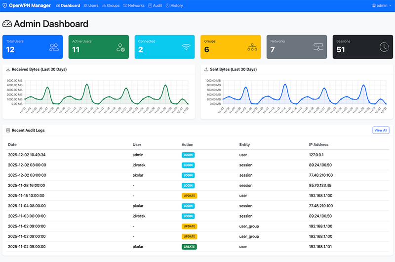

## Features

- **User Management**: Create, update, delete users with role-based access control
- **VPN User Validity**: Control user access with `is_active`, `valid_from`, `valid_to` fields
- **Static VPN IP**: Optionally assign static VPN IP addresses to users
- **Group Management**: Organize users into groups (IT, HR, Finance, etc.)
- **Network Management**: Define network segments (IP/CIDR) and assign them to groups
- **VPN Session Tracking**: Monitor active connections, traffic statistics, and usage history
- **VPN Client Config**: Generate and download .ovpn configuration files for users
- **Role-Based Access Control (RBAC)**:
  - `USER` - Can only view and edit their own profile
  - `MANAGER` - Can create and manage users assigned to them
  - `ADMIN` - Full access to all resources including networks, VPN sessions, and audit logs
- **Manager Hierarchy**: Users can be assigned to a manager for hierarchical access control
- **Audit Logging**: Track all operations (create, read, update, delete, login, logout)
- **REST API**: Full-featured API with Swagger documentation
- **VPN Auth API**: Dedicated API endpoints for OpenVPN server integration
- **Web Interface**: Bootstrap-based HTML interface for user-friendly management
- **Database Support**: PostgreSQL and MySQL support via GORM
- **JWT Authentication**: Secure token-based authentication
- **IP Filtering**: Restrict Swagger documentation access by IP/CIDR ranges
- **Flexible Logging**: Configurable output (stdout/file), format (text/JSON), and log levels

## Related Projects

- **[OpenVPN Client](https://github.com/tldr-it-stepankutaj/openvpn-client)** — Go-based integration layer between the OpenVPN server and this management API. Install it on the OpenVPN server to enable automatic user authentication, route assignment, session tracking, and firewall rule generation.

## Quick Install

### DEB (Debian, Ubuntu)

```bash
VERSION="1.1.0"
wget https://github.com/tldr-it-stepankutaj/openvpn-mng/releases/download/v${VERSION}/openvpn-mng_${VERSION}_linux_amd64.deb
sudo dpkg -i openvpn-mng_${VERSION}_linux_amd64.deb
```

### RPM (RHEL, AlmaLinux, Rocky Linux)

```bash
VERSION="1.1.0"
wget https://github.com/tldr-it-stepankutaj/openvpn-mng/releases/download/v${VERSION}/openvpn-mng_${VERSION}_linux_amd64.rpm
sudo dnf install ./openvpn-mng_${VERSION}_linux_amd64.rpm
```

### Docker

```bash
docker pull tldrit/openvpn-mng:latest
```

For detailed installation instructions, see **[Installation Guide](help/install.md)**.

## Quick Start

After installation:

1. **Generate secrets:**
   ```bash
   openssl rand -hex 32  # for jwt_secret
   openssl rand -hex 32  # for vpn_token (optional)
   ```

2. **Configure:**
   ```bash
   sudo nano /etc/openvpn-mng/config.yaml
   ```

3. **Start service:**
   ```bash
   sudo systemctl enable --now openvpn-mng.service
   ```

4. **Access web interface:**
   - URL: `http://localhost:8080`
   - Default credentials: `admin` / `admin123`

**Important:** Change the default password immediately after first login!

## Configuration

The application is configured via `/etc/openvpn-mng/config.yaml` (package install) or `config.yaml` (manual/Docker).

```yaml
server:
  host: "0.0.0.0"
  port: 8080

database:
  type: "postgres"
  host: "localhost"
  port: 5432
  username: "openvpn"
  password: "your-secure-password"
  database: "openvpn_mng"

api:
  enabled: true
  swagger_enabled: true
  vpn_token: ""  # Generate with: openssl rand -hex 32

auth:
  jwt_secret: ""  # Generate with: openssl rand -hex 32
  token_expiry: 24
  session_expiry: 8

logging:
  output: "stdout"
  format: "text"
  level: "info"

security:
  rate_limit_enabled: true
  rate_limit_requests: 5    # max requests per window
  rate_limit_window: 60     # window in seconds
  rate_limit_burst: 10      # burst size
  lockout_max_attempts: 5   # failed logins before lockout
  lockout_duration: 15      # lockout duration in minutes
```

### Environment Variables

Configuration can also be set via environment variables:

| Variable | Description |
|----------|-------------|
| `DB_HOST`, `DB_PORT`, `DB_USERNAME`, `DB_PASSWORD`, `DB_DATABASE` | Database connection |
| `AUTH_JWT_SECRET` | JWT signing secret |
| `API_VPN_TOKEN` | VPN Auth API token |
| `LOG_OUTPUT`, `LOG_FORMAT`, `LOG_LEVEL` | Logging configuration |
| `SECURITY_RATE_LIMIT_ENABLED` | Enable rate limiting (default: true) |
| `SECURITY_RATE_LIMIT_REQUESTS` | Max requests per window (default: 5) |
| `SECURITY_RATE_LIMIT_WINDOW` | Rate limit window in seconds (default: 60) |
| `SECURITY_RATE_LIMIT_BURST` | Rate limit burst size (default: 10) |
| `SECURITY_LOCKOUT_MAX_ATTEMPTS` | Failed logins before lockout (default: 5) |
| `SECURITY_LOCKOUT_DURATION` | Lockout duration in minutes (default: 15) |

See **[Installation Guide](help/install.md)** for complete environment variable list.

## Web Interface

| URL | Description |
|-----|-------------|
| `/login` | Login page |
| `/dashboard` | Dashboard |
| `/users` | User management |
| `/groups` | Group management |
| `/networks` | Network management (Admin only) |
| `/audit` | Audit logs (Admin only) |
| `/sessions` | VPN session history (Admin only) |
| `/vpn-settings` | VPN client config settings (Admin only) |
| `/profile` | User profile |

### Screenshots

<details>
<summary><strong>Login Page</strong></summary>

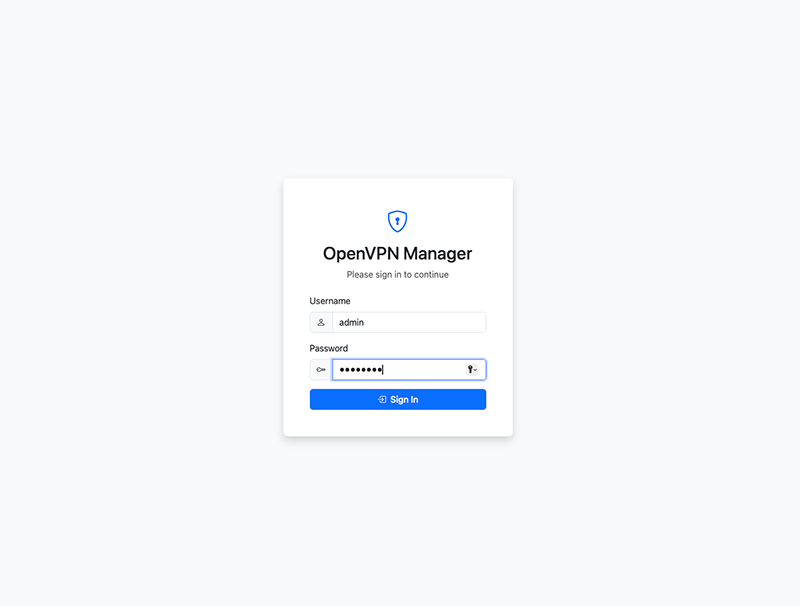

</details>

<details>
<summary><strong>Admin View</strong></summary>

**Dashboard**


**User Management**
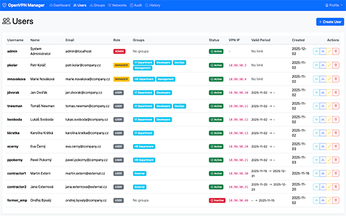

**User Detail**
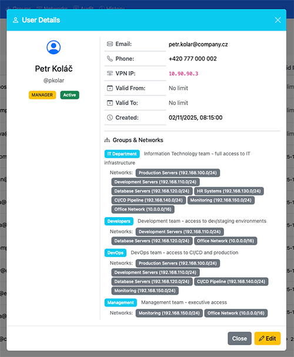

**User Edit**
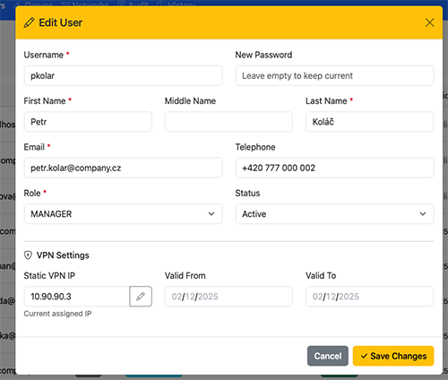

**Group Management**
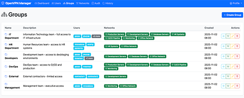

**Group Detail**
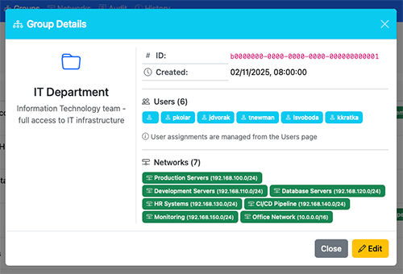

**Network Management**
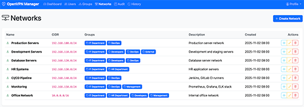

**Network Detail**
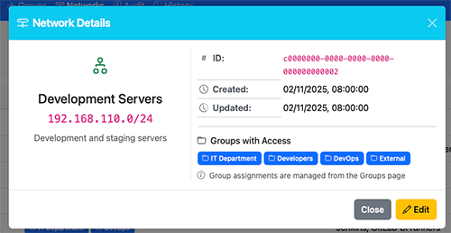

**Audit Logs**
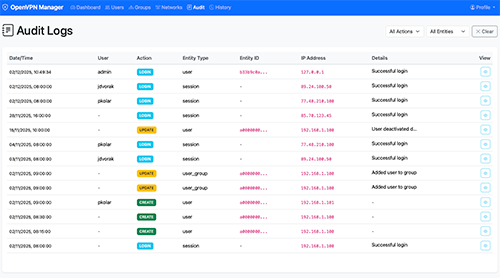

**VPN Session History**
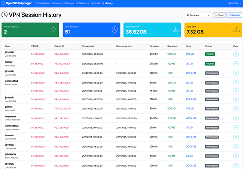

</details>

<details>
<summary><strong>Manager View</strong></summary>

**Dashboard**
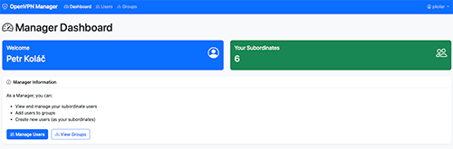

**User Management**
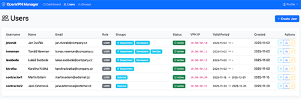

**Group View**
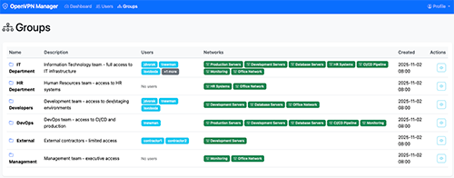

**Profile**
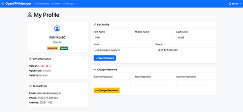

</details>

<details>
<summary><strong>User View</strong></summary>

**Dashboard**
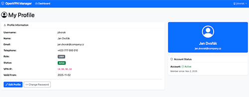

**Profile**
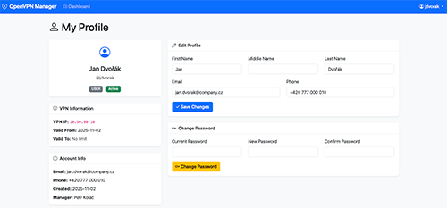

</details>

## VPN Auth API

The VPN Auth API provides dedicated endpoints for OpenVPN server integration using token-based authentication.

| Endpoint | Method | Description |
|----------|--------|-------------|
| `/api/v1/vpn-auth/authenticate` | POST | Validate VPN user credentials |
| `/api/v1/vpn-auth/users` | GET | List all active VPN users |
| `/api/v1/vpn-auth/users/{id}` | GET | Get user by ID |
| `/api/v1/vpn-auth/users/{id}/routes` | GET | Get user's network routes |
| `/api/v1/vpn-auth/users/by-username/{username}` | GET | Get user by username |
| `/api/v1/vpn-auth/sessions` | POST | Create VPN session |
| `/api/v1/vpn-auth/sessions/{id}/disconnect` | PUT | End VPN session |

All endpoints require the `X-VPN-Token` header. See **[Client Integration Guide](help/client.md)** for complete documentation.

## VPN Client Configuration

Users can download OpenVPN client configuration files (.ovpn) directly from the web interface:

- **Dashboard/Profile**: Download button available for all authenticated users
- **VPN Settings** (Admin only): Configure server address, port, protocol, CA certificate, TLS key, and template

| Endpoint | Method | Access | Description |
|----------|--------|--------|-------------|
| `/api/v1/vpn/client-config` | GET | Admin | Get current configuration |
| `/api/v1/vpn/client-config` | PUT | Admin | Create/update configuration |
| `/api/v1/vpn/client-config/preview` | GET | Admin | Preview generated .ovpn |
| `/api/v1/vpn/client-config/download` | GET | Auth | Download .ovpn file |
| `/api/v1/vpn/client-config/default-template` | GET | Admin | Get default template |

## Documentation

- **[Installation Guide](help/install.md)** - Complete installation instructions (DEB, RPM, Docker, Source)
- **[API Documentation](help/api.md)** - REST API reference with examples
- **[Client Integration Guide](help/client.md)** - OpenVPN server integration guide
- **[Testing Guide](help/test.md)** - Test suite structure and usage
- **Swagger UI** - Interactive API docs at `/swagger/index.html`

## Development

### Prerequisites

- Go 1.22+
- PostgreSQL 12+ or MySQL 8+
- swag CLI (`go install github.com/swaggo/swag/cmd/swag@latest`)

### Build from Source

```bash
git clone https://github.com/tldr-it-stepankutaj/openvpn-mng.git
cd openvpn-mng
make tools    # Install development tools
make deps     # Download dependencies
make swagger  # Generate Swagger docs
make build    # Build binary
```

### Testing

```bash
make test              # Run all tests
make test-race         # Run with race detection
make test-coverage-html # Generate coverage report
```

### Local Package Build

```bash
make release-snapshot  # Build packages locally (requires goreleaser)
```

See `make help` for all available targets.

## Database Schema

### Core Tables

- **users** - User accounts with VPN settings
- **groups** - User groups (IT, HR, Finance, etc.)
- **networks** - Network definitions (CIDR ranges)
- **vpn_sessions** - VPN connection history
- **vpn_traffic_stats** - Traffic statistics
- **vpn_client_configs** - VPN client configuration (single-row)
- **audit_logs** - Audit trail

### Junction Tables

- **user_groups** - Many-to-many: Users <-> Groups
- **network_groups** - Many-to-many: Networks <-> Groups

## Security Considerations

1. **Change default credentials** - Always change the default admin password
2. **Use strong secrets** - Generate with `openssl rand -hex 32`
3. **Enable SSL/TLS** - Use a reverse proxy with HTTPS in production
4. **Database security** - Use strong passwords and restrict database access
5. **IP filtering** - Restrict Swagger access to trusted IPs in production
6. **Audit logging** - Monitor audit logs for suspicious activity
7. **User validity** - Use `valid_from`/`valid_to` for temporary access
8. **VPN API authentication** - Use VPN token instead of service account
9. **Rate limiting** - Login and VPN auth endpoints are rate-limited per IP (configurable via `security` config)
10. **Account lockout** - Accounts are temporarily locked after repeated failed login attempts
11. **Token blacklist** - Logged-out JWT tokens are immediately invalidated until natural expiry
12. **CSRF protection** - Auth cookies use `SameSite=Lax` to prevent cross-site request forgery

## Contributing

1. Fork the repository
2. Create your feature branch (`git checkout -b feature/amazing-feature`)
3. Commit your changes (`git commit -m 'Add some amazing feature'`)
4. Push to the branch (`git push origin feature/amazing-feature`)
5. Open a Pull Request

## License

Apache License 2.0 - see [LICENSE](LICENSE) file for details.

## Links

- **GitHub**: https://github.com/tldr-it-stepankutaj/openvpn-mng
- **Docker Hub**: https://hub.docker.com/r/tldrit/openvpn-mng
- **Releases**: https://github.com/tldr-it-stepankutaj/openvpn-mng/releases
